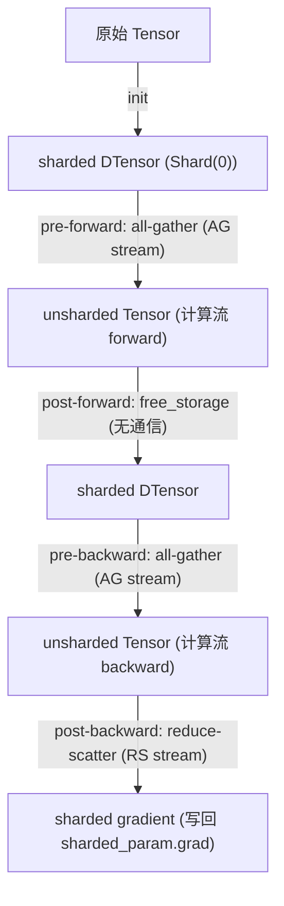

# FSDP2 代码架构梳理 — 总览

> 本文档为 FSDP2（`fully_shard`）代码架构梳理的总入口，基于 **PyTorch v2.12.0** 真实源码分析。
> 源码位置：`torch/distributed/fsdp/_fully_shard/`（共 9 个 Python 文件）。
> 分析依据：官方文档 [distributed.fsdp.fully_shard](https://docs.pytorch.org/docs/2.12/distributed.fsdp.fully_shard.html) + v2.12.0 源码逐文件阅读。

## 文档导航

| 序号 | 文档 | 内容 |
| --- | --- | --- |
| 1 | [01_目录结构与模块依赖.md](01_目录结构与模块依赖.md) | 9 个核心文件的一句话作用 + Mermaid 模块依赖树 |
| 2 | [02_核心入口与架构演进.md](02_核心入口与架构演进.md) | `fully_shard` 完整调用链 + FSDP1 vs FSDP2 对比表 |
| 3 | [03_核心类与职责拆解.md](03_核心类与职责拆解.md) | 6 个核心类 + 辅助类的职责/数据结构表 + 类关系图 |
| 4 | [04_运行时生命周期与时序.md](04_运行时生命周期与时序.md) | Init/Forward/Backward/Prefetch + CPU×CUDA 流时序图 |

## 工作概述

本次任务严格遵循 `stage1.md` 的约束，完成了对 FSDP2 的高层次代码架构梳理：

1. **以源码为准**：从 GitHub `pytorch/pytorch@v2.12.0` 拉取 `torch/distributed/fsdp/_fully_shard/` 全部 9 个源文件逐行阅读（临时存放于 `fsdp2/_src/` 供溯源），所有结论均基于真实代码，未与 FSDP1 混淆。
2. **官方文档校准**：对照 PyTorch 2.12 官方 API 文档与 FSDP2 教程，校准了通信分组、prefetch 调度、内存管理等关键知识点。
3. **图表规范**：全部架构图、依赖图、时序图均使用 Mermaid 语法，可直接渲染。
4. **禁止大段源码**：仅输出结构、概括、调用链与核心逻辑，未粘贴大段 Python 源码。

## 核心结论速览

### 架构本质

FSDP2 是一套 **Composable + DTensor** 的数据并行实现，与 FSDP1 的"FlatParameter + Wrapper"路线根本不同：

- **不包装模块**：通过动态修改 `module.__class__` 把 `FSDPModule` mixin union 进去，FQN 不变，可与 TP/EP/PP 组合。
- **per-parameter sharding**：每个参数独立 `torch.chunk(dim=0)` 成 DTensor，而非 flatten+concat。
- **显式分组**：每次 `fully_shard()` = 一个通信组，无 `bucket_cap_mb`，bottom-up 调用实现通信/计算重叠。

### 关键数据流

### 性能关键：三路重叠

FSDP2 通过 4 条高优先级 CUDA 流（copy-in / all-gather / reduce-scatter / all-reduce）+ CUDA Event 显式同步（**非 record_stream**），在 backward 阶段实现：

- **all-gather**（下一模块参数）∥ **计算**（当前模块反向）∥ **reduce-scatter**（上一模块梯度）

这是"逐层 `fully_shard`"推荐用法的根本原因——分组越细，可重叠的通信段越多。

## 与本项目代码的对应

本仓库 [fsdp_utils.py](../code/fsdp_utils.py) 中的 `apply_fsdp2` 正是官方推荐的 bottom-up 用法：

- 先对 `vit.patch_embed`、每个 `block`、`norm` 等子模块逐个 `fully_shard`；
- 最后对 root `model` 调用一次 `fully_shard`，把剩余参数（embeddings 等）归入 root 组。

这种写法使每个 TransformerBlock 成为一个独立通信组，forward/backward 时各 block 的 all-gather / reduce-scatter 可与相邻 block 的计算重叠，达到峰值显存节省与通信隐藏。

## 溯源说明

- 临时源码副本位于 `fsdp2/_src/`（v2.12.0 原始文件），供核对文档结论使用，可随时删除。
- 文档中所有"文件:行号"引用均对应 v2.12.0 版本。
