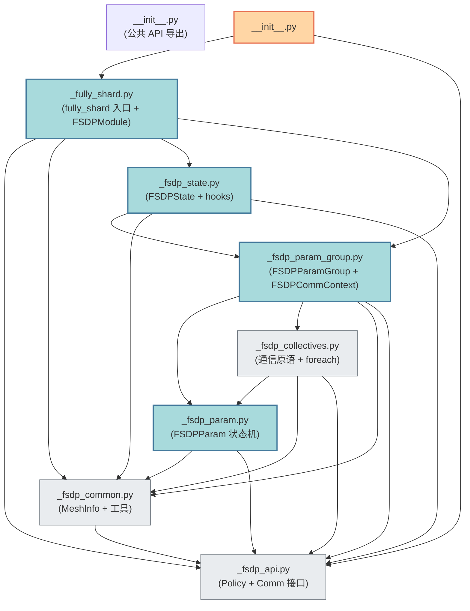

# 模块一：宏观目录与文件结构

> 基于 PyTorch v2.12.0 源码，核心代码位于 `torch/distributed/fsdp/_fully_shard/` 目录。

## 1. 关键文件路径与一句话概括

| 文件路径（相对 `torch/distributed/fsdp/_fully_shard/`） | 一句话作用 |
| --- | --- |
| `__init__.py` | 包入口，对外导出 `fully_shard`、`FSDPModule`、各类 Policy 及 `register_fsdp_forward_method` 等公共 API。 |
| `_fully_shard.py` | 定义核心入口函数 `fully_shard` 与用户面向的 `FSDPModule` 混入类（提供 `unshard`/`reshard`/prefetch 等方法），并通过 `@contract` 把 `FSDPState` 挂载到模块。 |
| `_fsdp_init.py` | 初始化阶段的全部逻辑：模块/参数收集（DFS）、mesh 校验、mesh_info 构建、参数分组（`_init_param_group`）、就地类替换（`_apply_to_module`）。 |
| `_fsdp_state.py` | 定义 `FSDPState`（每模块 1:1 状态）与 `FSDPStateContext`（跨模块共享状态），注册并实现 forward pre/post hook 与 backward hook，驱动 lazy init 与 prefetch。 |
| `_fsdp_param.py` | 定义 `FSDPParam`，管理**单个参数**的分片生命周期：原始参数 → sharded DTensor → unsharded 参数的状态机，含 padding、dtype、all-gather 输入/输出管理。 |
| `_fsdp_param_group.py` | 定义 `FSDPParamGroup`（一组一起通信的参数）与 `FSDPCommContext`（跨组共享的 CUDA 流/事件），实现 unshard/reshard、pre/post forward/backward、隐式与显式 prefetch。 |
| `_fsdp_collectives.py` | 通信原语抽象与实现：`AllGather`/`ReduceScatter` 接口及其 `Default`/`ProcessGroupAlloc`/`SymmMem` 实现，以及 `foreach_all_gather`/`foreach_reduce` 等批量通信函数。 |
| `_fsdp_common.py` | 通用基础设施：`DataParallelMeshInfo`/`FSDPMeshInfo`/`HSDPMeshInfo`/`DDPMeshInfo` 数据类、`TrainingState` 枚举、`_from_local_no_grad` 等 DTensor 工具函数。 |
| `_fsdp_api.py` | 策略与接口定义：`MixedPrecisionPolicy`、`OffloadPolicy`/`CPUOffloadPolicy`、`DataParallelMeshDims`，以及 `Comm`/`AllGather`/`ReduceScatter` 抽象基类。 |

## 2. 模块依赖树状图

下图展示 `_fully_shard/` 内各文件之间的 import 依赖与组织关系（箭头 `A --> B` 表示 A 依赖/导入 B）：

### 分层说明

- **入口层**：`__init__.py` → `_fully_shard.py`。用户唯一接触点是 `fully_shard()` 与 `FSDPModule`。
- **状态与编排层**：`_fsdp_state.py`（模块级状态机 + hook 编排）依赖 `_fsdp_param_group.py`（参数组级通信编排）。
- **执行层**：`_fsdp_param_group.py` 依赖 `_fsdp_param.py`（单参数状态机）与 `_fsdp_collectives.py`（实际 NCCL/通信调用）。
- **基础设施层**：`_fsdp_common.py`（mesh/dtype 工具）与 `_fsdp_api.py`（策略与接口）被几乎所有上层模块依赖，自身不依赖上层。

> 注意：`_fsdp_init.py` 在图中未单独画出 import 边，因为它被 `_fully_shard.py` 直接导入，且内部又延迟导入 `_fsdp_param_group.py`（避免循环依赖），属于"初始化胶水层"。
