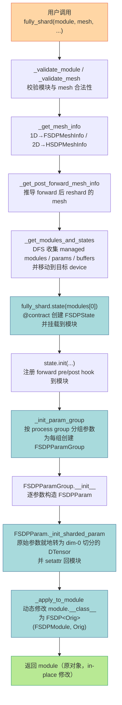

# 模块二：核心入口与架构演进

> 基于 PyTorch v2.12.0 源码 `torch/distributed/fsdp/_fully_shard/_fully_shard.py`。

## 1. `fully_shard` 完整调用链

从用户调用 `fully_shard(module, mesh=mesh)` 到完成参数分片与 Hook 注册，经过以下阶段：

### 关键步骤详解

1. **校验**：`_validate_module` 拒绝无 `forward` 的纯容器（`ModuleList`/`ModuleDict`）；`_validate_mesh` 要求 mesh 为 1D 或带名字的 2D。

2. **Mesh 信息构建**：`_get_mesh_info` 把 `DeviceMesh` 转成 `FSDPMeshInfo`（1D，`Shard(0)`）或 `HSDPMeshInfo`（2D，`Replicate(), Shard(0)`）。若传入 `dp_mesh_dims`，则从完整 SPMD mesh 抽取 DP 子 mesh（支持 TP/EP 共存）。

3. **模块收集**：`_get_modules_and_states` → `_get_managed_modules` 做一次 DFS，**不递归进入**已应用 `fully_shard` 的子模块（实现"逐层分组"），收集到的 params/buffers 通过 `_move_states_to_device` 移到 device。

4. **State 创建与 Hook 注册**：`@contract(state_cls=FSDPState)` 装饰器把 `FSDPState` 实例挂到模块（通过 `_insert_module_state`）。`state.init()` 在模块上 `register_forward_pre_hook(_pre_forward, prepend=True)` 与 `register_forward_hook(_post_forward)`。

5. **参数分组与分片**：`_init_param_group` 按 process group 把参数分组，每组构造一个 `FSDPParamGroup`；其内部为每个参数构造 `FSDPParam`，调用 `_init_sharded_param` 把原始 `torch.Tensor`/`DTensor` 就地切分为 dim-0 sharded DTensor，并通过 `_setattr_on_modules` 写回模块（FQN 不变）。

6. **类替换（非包装）**：`_apply_to_module` 把 `module.__class__` 动态改为 `type("FSDP"+OrigName, (FSDPModule, Orig), {...})`，使 `isinstance(module, FSDPModule)` 为真，同时保留原类全部方法。**不创建 wrapper 模块**，因此 `state_dict` 的 FQN 完全不变。

## 2. FSDP1 vs FSDP2 根本性改变

| 维度 | FSDP1（`FullyShardedDataParallel`） | FSDP2（`fully_shard`） |
|---|---|---|
| **参数表示** | FlatParameter：把一组参数 flatten + concat 成单个 1D 大张量再切分 | DTensor：每个参数独立按 dim-0（或指定 dim）`torch.chunk` 切分，保留原始形状语义 |
| **模块包装方式** | 包装类：`FullyShardedDataParallel(module)` 创建新 wrapper 模块 | Composable：就地修改 `module.__class__`，union `FSDPModule`，不创建 wrapper，FQN 不变 |
| **扩展点机制** | Hook 机制为主（forward/pre-backward hook 注册在 wrapper 上） | Subclass + Hook：参数用 DTensor 子类表达分片；模块用动态类混入；同时保留 forward/backward hook |
| **内存管理** | `record_stream`：多流使用靠 record_stream 让 caching allocator 延迟回收，需 `limit_all_gathers=True` 阻塞 CPU 保证确定性 | **不使用 record_stream**：通过 storage resize（`alloc_storage`/`free_storage`）+ CUDA Event 显式同步流，内存使用确定且无需阻塞 CPU |
| **通信分组** | `bucket_cap_mb` 自动分桶，按梯度就绪顺序触发 | 显式分组：每次 `fully_shard` 调用 = 一个通信组，无自动分桶，由用户模块结构决定 |
| **状态字典** | 内置 full state dict 支持（需 all-gather） | 不直接支持 full state dict；用 sharded DTensor state dict，通过 `DTensor.full_tensor()` 或分布式 checkpoint 转换 |
| **冻结参数** | FlatParameter 下约束较多 | per-parameter sharding 放宽约束，冻结参数更自然 |
| **Optimizer** | 可用原始参数或 flat 参数 | 必须用 DTensor 参数初始化 optimizer，step 在 sharded DTensor 上进行 |
| **Prefetch 控制** | 有限，内部自动 | 暴露 `set_modules_to_forward_prefetch` / `set_modules_to_backward_prefetch` 等显式 API |
| **HSDP / TP / EP** | HSDP 支持有限 | 原生支持 HSDP（2D mesh）、SPMD mesh（`dp_mesh_dims`）、per-param mesh（`shard_placement_fn`，MoE 场景） |

### 架构演进核心总结

FSDP2 的根本性转变可以归纳为三点：

1. **从"扁平化包装"到"组合式扩展"**：不再用 wrapper 模块吞掉子模块，而是就地改类 + DTensor 表达，使 FSDP 与 TP/EP/PP 等并行策略可组合（composable）。

2. **从"record_stream 赌运气"到"Event 显式同步"**：FSDP1 依赖 `record_stream` 让 allocator 在多流间安全回收，行为不确定且需 `limit_all_gathers` 阻塞 CPU；FSDP2 用 `alloc_storage`/`free_storage` 配合 `torch.Event` 在 `all_gather_stream`/`reduce_scatter_stream`/`all_gather_copy_in_stream` 间精确同步，内存行为确定。

3. **从"自动分桶"到"显式分组"**：通信边界完全由用户调用 `fully_shard` 的位置决定（bottom-up），消除了 `bucket_cap_mb` 调参负担，同时让通信/计算重叠的调度更可控。
