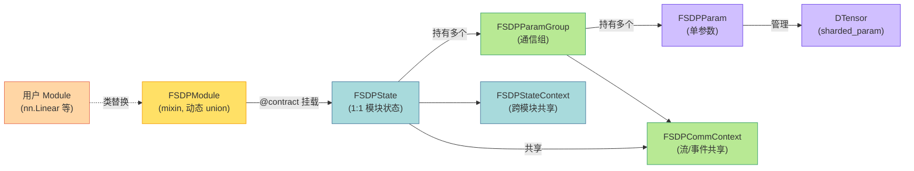

# 模块三：核心类与职责拆解

> 基于 PyTorch v2.12.0 源码 `torch/distributed/fsdp/_fully_shard/`。

## 核心类总览表

| 类名 | 所在文件 | 核心职责 | 管理的关键数据结构 |
| --- | --- | --- | --- |
| **`FSDPModule`** | `_fully_shard.py` | 用户面向的混入类（mixin），通过动态类替换 union 到原模块上；暴露 `unshard()`/`reshard()`/`set_modules_to_*_prefetch`/`set_requires_gradient_sync` 等运行时控制 API；本身不存状态，通过 `_get_fsdp_state()` 委托给 `FSDPState`。 | 无自有字段；持有对 `FSDPState` 的间接引用（`@contract` 挂载） |
| **`FSDPState`** | `_fsdp_state.py` | 每个被 `fully_shard` 的模块 1:1 绑定的状态对象；注册并实现 forward pre/post hook 与 backward hook；负责 lazy init（识别 root、收集 all_states、初始化共享 comm context）；驱动 prefetch 与 final callback。 | `_fsdp_param_groups: list[FSDPParamGroup]`、`_state_ctx: FSDPStateContext`、`_comm_ctx: FSDPCommContext`、`_training_state: TrainingState`、`_states_to_forward/backward_prefetch` |
| **`FSDPStateContext`** | `_fsdp_state.py` | 跨所有 FSDPState 共享的"一次 forward/backward"级状态；记录本次 forward 的 root、是否已排队 final callback、是否最后一次 backward、optimizer 后的同步 event。 | `all_states: list[FSDPState]`、`iter_forward_root`、`post_backward_final_callback_queued`、`is_last_backward`、`post_optim_event` |
| **`FSDPParamGroup`** | `_fsdp_param_group.py` | 一组"一起 all-gather / 一起 reduce-scatter"的参数的管理者；实现 `unshard`/`wait_for_unshard`/`reshard`/`pre_forward`/`post_forward`/`pre_backward`/`post_backward`；管理组级 sharded 状态机与 prefetch 索引。 | `fsdp_params: list[FSDPParam]`、`mesh_info`、`post_forward_mesh_info`、`_all_gather_result`、`_post_reduce_event`、`_post_forward_indices`、`comm_ctx` |
| **`FSDPParam`** | `_fsdp_param.py` | 单个参数的分片生命周期管理；实现原始参数 → sharded DTensor → unsharded 参数的状态转换；处理 padding、dtype 转换、all-gather 输入/输出张量、梯度提取。 | `sharded_param`(DTensor)、`_sharded_param_data`(1D)、`_unsharded_param`、`all_gather_outputs`、`_sharding_spec`(DTensorSpec)、`sharded_state: ShardedState`、`fsdp_placement: Shard` |
| **`FSDPCommContext`** | `_fsdp_param_group.py` | 跨所有参数组共享的通信流与同步状态；创建 4 条高优先级 CUDA 流（all-gather copy-in / all-gather / reduce-scatter / all-reduce）；维护 all-gather 重叠状态与 reduce-scatter 状态列表及 post-forward 顺序。 | `all_gather_copy_in_stream`、`all_gather_stream`、`reduce_scatter_stream`、`all_reduce_stream`、`all_gather_state`、`reduce_scatter_states`、`post_forward_order` |

## 辅助类（支撑核心逻辑）

| 类名 | 所在文件 | 职责 |
| --- | --- | --- |
| `FSDPMeshInfo` / `HSDPMeshInfo` / `DDPMeshInfo` | `_fsdp_common.py` | 描述 mesh 的分片/复制维度，缓存 `shard_process_group`/`replicate_process_group` 与 rank/size。 |
| `ShardedState` (Enum) | `_fsdp_param.py` | 单参数状态机三态：`SHARDED` / `SHARDED_POST_FORWARD` / `UNSHARDED`。 |
| `TrainingState` (Enum) | `_fsdp_common.py` | 模块/组级训练状态：`IDLE` / `FORWARD` / `PRE_BACKWARD` / `POST_BACKWARD`。 |
| `MixedPrecisionPolicy` / `OffloadPolicy` / `CPUOffloadPolicy` | `_fsdp_api.py` | 混合精度与 CPU offload 策略的数据类。 |
| `AllGather` / `ReduceScatter` (ABC) 及 `Default*`/`SymmMem*`/`ProcessGroupAlloc*` | `_fsdp_collectives.py` | 通信原语接口与多种后端实现。 |
| `ParamModuleInfo` | `_fsdp_param.py` | 记录参数所属模块与参数名（含共享模块），用于 `_setattr_on_modules` 就地换参。 |
| `RegisterPostBackwardFunction` | `_fsdp_param_group.py` | autograd.Function，在 backward 时触发 `FSDPParamGroup.post_backward()`。 |

## 类之间的关系图

## 职责分层要点

- **`FSDPModule`（API 层）**：只做"门面"，把用户调用翻译成对 `FSDPState` 的操作，不持有运行时数据。
- **`FSDPState`（编排层）**：是 hook 的实际宿主，协调"本模块的多个 param group"与"全局共享状态"。
- **`FSDPParamGroup`（执行层）**：是通信的最小调度单位，一个 group = 一次 all-gather + 一次 reduce-scatter。
- **`FSDPParam`（数据层）**：只关心单个张量的 sharded/unsharded 转换与内存，不关心通信调度。
- **`FSDPCommContext`（基础设施层）**：所有流与 event 的单例式管理者，保证跨组 overlap 正确同步。
