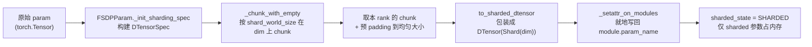
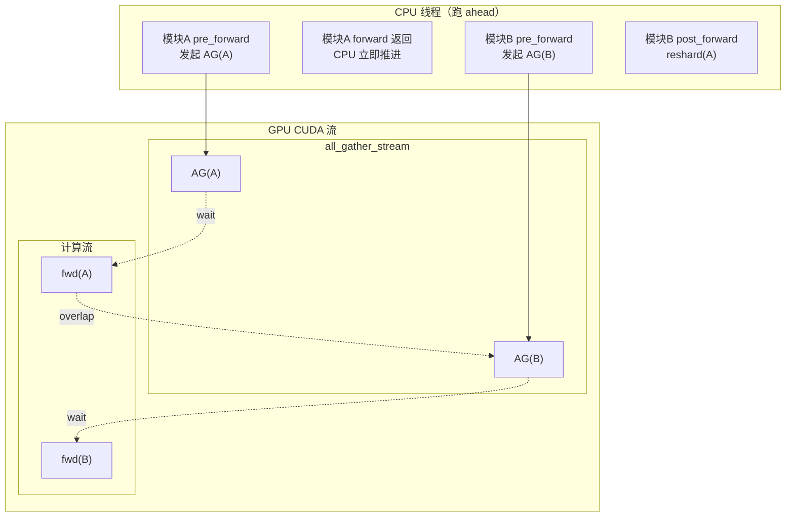

# 模块四：运行时生命周期与调用时序

> 基于 PyTorch v2.12.0 源码 `torch/distributed/fsdp/_fully_shard/`。
> 涉及文件：`_fsdp_state.py`、`_fsdp_param_group.py`、`_fsdp_param.py`、`_fsdp_collectives.py`。

## 1. Initialization（Sharding 阶段）

参数从普通 `torch.Tensor` 转为 dim-0 切分的 `DTensor` 的过程发生在 `fully_shard()` 调用时（非 lazy）：



**关键点**：

- 切分用 `torch.chunk` 而非 flatten+concat，保留原始 ND 形状语义。
- 不均匀切分时对 0 号 chunk 做 padding（`padded_sharded_param`），避免 all-gather 前再 pad。
- 若参数已是 DTensor（TP/EP 场景），走 `_init_sharding_spec_tp`/`_init_sharding_spec_spmd`，用 `_StridedShard` 表达 DP 与 TP 维度的交错分片。
- **lazy_init 延后**：CUDA 流、FQN、root 判定等到首次 forward 时才完成（`_lazy_init`），因为此时所有 `fully_shard` 调用才结束、模块树才定型。

## 2. Forward Pass

### 2.1 Pre-forward（Unshard / All-gather）

调用链：`module(input)` → `FSDPState._pre_forward` → `FSDPParamGroup.pre_forward`

1. **Root pre-forward**（仅本次 forward 的 root 触发一次）：`_root_pre_forward` → `_lazy_init`（首次）→ 让 `all_gather_copy_in_stream`/`all_gather_stream` 等待当前计算流（或 optimizer event）。
2. **逐组 unshard**：对每个 `FSDPParamGroup` 调 `pre_forward`：
   - `unshard(async_op)` → `foreach_all_gather`：
     - 在 `all_gather_copy_in_stream` 上把各参数 sharded data copy-in 到连续 buffer；
     - `all_gather_stream` 等 copy-in 流，发起 `dist.all_gather_into_tensor`（async）。
   - `wait_for_unshard()` → `foreach_all_gather_copy_out`：计算流等 all-gather event，把结果 split copy 到各参数的 `all_gather_outputs`，构造 `_unsharded_param`（autograd leaf），`_setattr_on_modules` 写回模块。
3. **隐式 forward prefetch**：CPU 跑得比 GPU 快，下一个模块的 pre-forward hook 会提前在 `all_gather_stream` 上发起 all-gather，与当前模块 forward 计算重叠。

### 2.2 Compute

模块原始 `forward()` 在**计算流**上执行，此时参数已是 unsharded 的完整张量。

### 2.3 Post-forward（Reshard）

`FSDPState._post_forward` → `FSDPParamGroup.post_forward`：

- 若 `reshard_after_forward=True`（非 root 默认）：`reshard()` → `_to_sharded()`，通过 `free_storage` 释放 unsharded 参数内存（**无通信**），把 sharded DTensor 写回模块。
- 若 `reshard_after_forward=False`（root 默认）：保留 unsharded 参数，backward 时省去 all-gather。
- 若为 int（部分 reshard）：`_to_sharded_post_forward()`，reshard 到更小 world size。
- 记录 `post_forward_order`（供 backward prefetch 用）。
- 对 output 注册 `_pre_backward` hook（通过 `register_hook`）。

## 3. Backward Pass

### 3.1 Pre-backward（Unshard / All-gather）

当 autograd 反向传播到某模块的输出张量时，触发 `FSDPState._pre_backward`：

1. 设置 `TrainingState.PRE_BACKWARD`，排队 final callback（`_register_root_post_backward_final_callback`）。
2. 对每个 param group 调 `pre_backward`：
   - `unshard()`（若 forward 后已 reshard 则重新 all-gather；若未 reshard 则 no-op）。
   - `wait_for_unshard()`。
   - **隐式 backward prefetch**：`_backward_prefetch()` 从 `post_forward_order` 取前一个模块，提前发起 all-gather，与当前模块反向计算重叠。

### 3.2 Compute

autograd 在计算流上反向计算梯度，参数为 unsharded 状态，梯度写入 `_unsharded_param.grad`。

### 3.3 Post-backward（Reshard + Reduce-scatter）

通过 `RegisterPostBackwardFunction`（autograd.Function）在反向结束时触发 `FSDPParamGroup.post_backward`：

1. **累积梯度**（混合精度 reduce_dtype 场景）。
2. **reshard**：`reshard()` 释放 unsharded 参数（若 `reshard_after_backward=True`）。
3. **reduce-scatter**：`foreach_reduce` 在 `reduce_scatter_stream` 上把 unsharded 梯度 reduce-scatter 成 sharded 梯度，写回 `sharded_param.grad`。
4. **HSDP all-reduce**（若 2D mesh）：在 `all_reduce_stream` 上对 replicate 维做 all-reduce。
5. **同步**：记录 `_post_reduce_event`，下一个模块的计算流等待它以实现 RS 与计算 overlap。
6. **Final callback**（root）：`_root_post_backward_final_callback` 处理无梯度输入的模块、清理 prefetch 状态、等待最后一个 RS event。

## 4. Prefetching 机制

FSDP2 的 prefetch 分**隐式**与**显式**两种，核心是利用 CPU 线程跑 ahead 于 GPU，在独立 CUDA 流上提前发起通信。

### 4.1 四条 CUDA 流

| 流 | 用途 | 优先级 |
|---|---|---|
| 计算流（default） | forward/backward 计算 | 默认 |
| `all_gather_copy_in_stream` | all-gather 前的 copy-in（仅 forward 隐式 prefetch 用） | 高(-1) |
| `all_gather_stream` | all-gather 集合通信 | 高(-1) |
| `reduce_scatter_stream` | reduce-scatter 集合通信 | 高(-1) |
| `all_reduce_stream` | HSDP all-reduce | 默认 |

### 4.2 隐式 Forward Prefetch

- CPU 线程在当前模块 `pre_forward` 中发起本组 all-gather 后**立即返回**，CPU 继续推进到下一模块的 `pre_forward`，在 `all_gather_stream` 上发起下一组 all-gather。
- GPU 上：当前模块 forward 计算与下一组 all-gather 并行。
- **copy-in/copy-out 重叠**：`wait_for_unshard` 把当前 all-gather 的 copy-out event 存入 `all_gather_state`，下一组的 copy-in 会先等待并释放上一组输出（见源码 `[Note: Overlapping all-gather copy-in and all-gather]`）。

### 4.3 隐式 Backward Prefetch

- `pre_backward` 中 `wait_for_unshard` 后调用 `_backward_prefetch`：从 `post_forward_order`（记录了 forward 实际执行顺序）取出前一个模块，在 `all_gather_stream` 上提前 all-gather。
- 同时 reduce-scatter 在独立 `reduce_scatter_stream` 上运行，与计算和 all-gather 三路重叠。

### 4.4 显式 Prefetch

- `set_modules_to_forward_prefetch` / `set_modules_to_backward_prefetch`：用户显式声明"当前模块 forward/backward 时预取哪些模块"。
- 在 `_pre_forward`/`_pre_backward` 中遍历 `_states_to_forward/backward_prefetch`，调用 `FSDPParamGroup._prefetch_unshard` 提前发起 all-gather。
- 适用于 CPU 开销大、隐式 prefetch 来不及的场景。

### 4.5 CPU 线程与 CUDA 流的调度关系



> CPU 线程不阻塞等待 GPU：`unshard(async_op)` 发起 async work 后立即返回，靠 `wait_for_unshard` 在计算流上插入 event 等待来保证正确性。

## 5. Forward + Backward 核心模块调用时序图

下图展示两个 FSDP 模块（m1, m2）在一次 forward + backward 中，CPU 线程、计算流、all-gather 流、reduce-scatter 流之间的交互：

```mermaid
sequenceDiagram
    autonumber
    participant CPU as CPU 线程
    participant COMP as 计算流 (default)
    participant AG as all_gather_stream
    participant RS as reduce_scatter_stream

    Note over CPU,RS: ═══════ Forward Pass ═══════

    CPU->>COMP: m1(input) 触发 _pre_forward (root)
    CPU->>AG: lazy_init; AG/CopyIn 流 wait 计算流
    CPU->>AG: m1.unshard → foreach_all_gather<br/>copy-in on CopyIn 流, AG(A) async
    Note over AG: AG(A) 开始
    CPU->>COMP: m1.wait_for_unshard<br/>计算流 wait AG(A) event
    CPU->>COMP: m1._to_unsharded, 注册 post_backward hook
    CPU->>COMP: m1.forward() 开始计算 fwd(m1)
    Note over COMP: fwd(m1) 执行中

    Note over CPU: CPU 跑 ahead, 不等 GPU
    CPU->>AG: m2._pre_forward → m2.unshard<br/>AG(B) async (与 fwd(m1) 重叠)
    Note over AG: AG(B) 与 fwd(m1) 并行
    CPU->>COMP: m2.wait_for_unshard → wait AG(B)
    CPU->>COMP: m2.forward() → fwd(m2)
    CPU->>COMP: m2._post_forward → reshard(m2)<br/>free unsharded (无通信)
    CPU->>COMP: m1._post_forward → reshard(m1)<br/>记录 post_forward_order=[m1,m2]

    Note over CPU,RS: ═══════ Backward Pass ═══════

    Note over CPU: autograd 反向, 先触发 m2 的 _pre_backward
    CPU->>COMP: m2._pre_backward (grad hook)
    CPU->>RS: 排队 final callback
    CPU->>AG: m2.unshard → AG(B') (若已 reshard)
    CPU->>COMP: m2.wait_for_unshard
    Note over CPU: 隐式 backward prefetch
    CPU->>AG: _backward_prefetch → AG(m1) 提前发起
    Note over AG: AG(m1) 与 bwd(m2) 并行
    CPU->>COMP: bwd(m2) 计算梯度

    Note over CPU: RegisterPostBackwardFunction.backward 触发 m2.post_backward
    CPU->>RS: m2.post_backward → reshard(m2)
    CPU->>RS: foreach_reduce → RS(grad_m2) async
    Note over RS: RS(m2) 与 bwd(m1) 并行

    Note over CPU: autograd 触发 m1 的 _pre_backward
    CPU->>COMP: m1._pre_backward → wait AG(m1)
    CPU->>COMP: bwd(m1) 计算梯度
    CPU->>RS: m1.post_backward → reshard(m1)
    CPU->>RS: foreach_reduce → RS(grad_m1) async
    CPU->>COMP: m1 计算流 wait RS(m2) event (overlap)

    Note over CPU: final callback (root)
    CPU->>COMP: _root_post_backward_final_callback
    CPU->>COMP: 计算流 wait 最后一个 RS event
    CPU->>RS: 清理 reduce_scatter_states
```

### 时序图要点解读

1. **Forward 阶段**：CPU 线程在发起 `AG(A)` 后不阻塞，立即推进到 m2 发起 `AG(B)`，使 `AG(B)` 与 `fwd(m1)` 在 GPU 上并行（计算/通信重叠）。post-forward 的 reshard 只是 `free_storage`，无通信。

2. **Backward 阶段**：反向按 forward 逆序触发（m2 先于 m1）。`pre_backward` 中通过 `_backward_prefetch` 提前发起 `AG(m1)`，与 `bwd(m2)` 并行；同时 `RS(m2)` 在独立流上与 `bwd(m1)` 并行，实现 **all-gather / 计算 / reduce-scatter 三路重叠**。

3. **流同步靠 Event**：跨流依赖通过 `torch.Event` 表达（如计算流 `wait_event(AG event)`），而非 `record_stream`。`foreach_all_gather_copy_out` 与 `foreach_reduce` 内部记录 event，下游流等待这些 event。

4. **Final callback 兜底**：最后一个模块的 RS event 没有后续模块来 wait，由 `_root_post_backward_final_callback` 在计算流上显式等待，保证梯度 reduce 完成后才进入 optimizer step。
