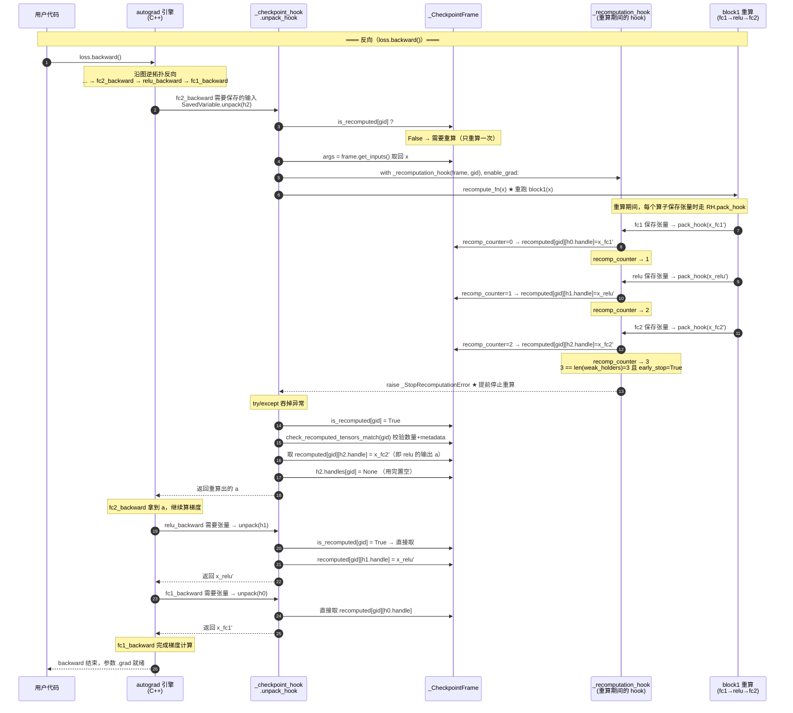

# PyTorch 重计算（Activation Checkpointing）详解

> 源码位置：`/home/zxb/code/torch_fsdp2/pytorch/torch/utils/checkpoint.py`（1711 行）
>
> 核心源码文件：
> - `torch/utils/checkpoint.py`：`checkpoint`、`CheckpointFunction`、`_checkpoint_without_reentrant_generator`、`_CheckpointFrame`、`_checkpoint_hook`、`_recomputation_hook`
> - `torch/autograd/graph.py:264`：`saved_tensors_hooks`（pack/unpack 钩子的 Python 入口）
> - `torch/csrc/autograd/saved_variable.cpp`：`SavedVariable` 的 C++ 实现，pack/unpack 在此触发
> - `torch/distributed/_composable/checkpoint_activation.py`：FSDP 用的 composable checkpoint（基于非重入）
>
> 本文用一个**具体例子**讲清三件事：① 怎么用；② "非重入（non-reentrant）"到底是什么意思；③ 从代码角度看，重计算是如何发生的。最后给出前向/反向的 mermaid 时序图。

---

## 一、什么是重计算（Activation Checkpointing）

普通训练里，前向算出的**中间激活（activation）**会被保存在 autograd 计算图里，留到反向算梯度用。显存大头往往就是这些激活。

重计算（又叫 gradient checkpointing / activation checkpointing，简称 AC）的思路是：**前向时不保存 checkpoint 区域内的中间激活，只保存区域的输入；反向需要梯度时，把区域的前向重新跑一遍，把激活重新算出来，再算梯度。** 用算力换显存。

```text
无 AC:
  前向: 算完，把所有中间激活存下来        → 显存高
  反向: 直接用存的激活算梯度

有 AC（对 block1 做 checkpoint）:
  前向: 算完，但 block1 内部的激活不存     → 显存低（只存 block1 的输入）
  反向: 把 block1 的前向重跑一遍 → 重新生成激活 → 再算梯度
```

---

## 二、一个具体例子

下面这个例子贯穿全文。模型有三个 block，我们对中间的 `block1` 做激活重计算：

```python
import torch
import torch.nn as nn
from torch.utils.checkpoint import checkpoint

class Block(nn.Module):
    def __init__(self, dim, hidden):
        super().__init__()
        self.fc1 = nn.Linear(dim, hidden)
        self.fc2 = nn.Linear(hidden, dim)
        self.relu = nn.ReLU()

    def forward(self, x):
        # 两个中间激活: a = relu(fc1(x)), out = fc2(a)
        a = self.relu(self.fc1(x))   # 中间激活 a
        return self.fc2(a)           # 输出 out

class Model(nn.Module):
    def __init__(self):
        super().__init__()
        self.block0 = Block(512, 2048)
        self.block1 = Block(512, 2048)
        self.block2 = Block(512, 2048)

    def forward(self, x):
        x = self.block0(x)
        # ★ 对 block1 使用重计算（非重入，推荐）
        x = checkpoint(self.block1, x, use_reentrant=False)
        x = self.block2(x)
        return x

model = Model().cuda()
x = torch.randn(32, 512, device="cuda")
out = model(x)
loss = out.sum()
loss.backward()
```

重点看这一行：

```python
x = checkpoint(self.block1, x, use_reentrant=False)
```

- `function = self.block1`：要重计算的区域
- `args = (x,)`：区域的输入（会被保存下来，留到反向重计算时用）
- `use_reentrant=False`：使用**非重入**实现（官方推荐）

从用户角度看，`checkpoint(...)` 的返回值和直接调用 `self.block1(x)` 一模一样，只是显存占用变了、反向多了一次前向重算。

---

## 三、如何使用

### 3.1 `torch.utils.checkpoint.checkpoint`

完整签名（`checkpoint.py:355`）：

```python
def checkpoint(
    function,
    *args,
    use_reentrant: bool | None = None,
    context_fn: Callable = noop_context_fn,
    determinism_check: str = "default",
    debug: bool = False,
    early_stop: bool = True,
    **kwargs
):
```

关键参数：

| 参数 | 含义 |
| --- | --- |
| `function` | 要重计算的区域（一个可调用对象，如 `block1` 或 lambda） |
| `*args` | 传给 function 的位置参数（这些会被保存，反向重计算时重新喂进去） |
| `use_reentrant` | **必须显式传**。`False`=非重入（推荐）；`True`=重入（旧实现） |
| `context_fn` | 返回两个上下文管理器的元组，分别套在前向和重计算外（仅 `use_reentrant=False` 支持），用于选择性重计算（SAC） |
| `determinism_check` | `"default"` 校验重计算出的张量 shape/dtype/device 与前向一致；`"none"` 关闭 |
| `debug` | 出错时打印前向与重计算的算子 trace 对比 |
| `early_stop` | 非重入下，重算出所有需要的激活后**立即停止**（默认 `True`） |

### 3.2 `checkpoint_sequential`（顺序模型专用）

`checkpoint.py:526`：把一个 `nn.Sequential` 或函数列表切成 `segments` 段，每段做一个 checkpoint。本质是对每段调用 `checkpoint`。

```python
model = nn.Sequential(layer1, layer2, layer3, layer4)
out = checkpoint_sequential(model, segments=2, input, use_reentrant=False)
```

### 3.3 composable checkpoint（FSDP 常用）

`torch/distributed/_composable/checkpoint_activation.py:38` 提供了一个**不改模型结构、不包装 nn.Module** 的 composable API：

```python
from torch.distributed._composable import checkpoint as checkpoint_composable

# 直接给模块"贴"上重计算，注册的是 pre/post-forward hook
checkpoint_composable(model.block1)
# 之后正常调用 model.block1(x) 即可，无需改 forward 代码
```

它的底层就是 `_checkpoint_without_reentrant_generator`，强制 `use_reentrant=False`（`checkpoint_activation.py:73`）。FSDP2 + AC 推荐用这种方式。

---

## 四、"非重入（non-reentrant）"到底是什么意思

这是理解 PyTorch 重计算的关键。要讲清"非重入"，必须和"重入（reentrant）"对比。

### 4.1 重入（`use_reentrant=True`）：在 backward 里再调一次 backward

重入实现基于 `torch.autograd.Function`（`checkpoint.py:234` 的 `CheckpointFunction`）：

```python
class CheckpointFunction(torch.autograd.Function):
    @staticmethod
    def forward(ctx, run_function, preserve_rng_state, *args):
        # ★ 整个前向在 no_grad 下跑 → 不记录 autograd 图
        with torch.no_grad():
            outputs = run_function(*args)
        # 只保存输入张量（save_for_backward）
        ctx.save_for_backward(*tensor_inputs)
        return outputs

    @staticmethod
    def backward(ctx, *args):
        # ★★ 在 backward 里重新前向，并且开 enable_grad 重建一张新的 autograd 图
        with torch.enable_grad():
            outputs = ctx.run_function(*detached_inputs)
        # ★★ 然后对这张新图再调一次 backward！
        torch.autograd.backward(outputs_with_grad, args_with_grad)
        return (None, None) + grads
```

所谓"重入"，就是：**`backward` 方法内部又调用了 `torch.autograd.backward`**。autograd 引擎正在执行反向传播，执行到 `CheckpointFunction.backward` 时，**再次进入** autograd 引擎去跑一段新的反向。这就是"re-entrant"（重新进入）的字面含义。

代价：
- 前向在 `no_grad` 下跑，**完全不留 autograd 图**，所以 checkpoint 区域里不能有 `torch.autograd.grad`、不能有 detached tensor、至少一个输入输出要 `requires_grad=True`……一堆限制。
- `backward` 里会把整个 `run_function` **从头到尾重跑一遍**，无法提前停止。
- 不支持 `**kwargs` 传给 function（`checkpoint.py:500`）。

### 4.2 非重入（`use_reentrant=False`）：不重新进入 autograd，而是"替换保存的张量"

非重入实现**不**用 `torch.autograd.Function`，而是用 `torch.autograd.graph.saved_tensors_hooks`（pack/unpack 钩子）。核心思想：

> 前向照常跑、照常建 autograd 图（grad 是开的），但**拦截"保存张量"这个动作**——本该保存的中间激活，被替换成一个占位符（`_Holder`），于是激活本身被释放、显存省下。反向需要用到这个激活时，再把前向重跑一遍，把激活重新算出来填回去。

这里**没有**在 backward 里调用 backward。反向传播还是原来那条 autograd 图、原来那次引擎执行，只是当引擎访问某个"被替换掉的保存张量"时，触发一次**前向重算**（`enable_grad` 下跑 `function`，但跑完就算了，不会再对它调 `backward`）。所以叫"非重入"——不会重新进入 autograd 反向引擎。

一句话总结：

| | 重入（reentrant） | 非重入（non-reentrant） |
| --- | --- | --- |
| 实现机制 | `torch.autograd.Function` | `saved_tensors_hooks`（pack/unpack） |
| 前向是否建 autograd 图 | **否**（在 `no_grad` 下跑） | **是**（正常建图） |
| 反向如何拿到激活 | 在 `backward` 里 `enable_grad` 重跑 function，再对结果调 `backward` | unpack 时重跑 function，把激活填回原图的占位符 |
| 是否"重新进入" autograd 引擎 | **是**（backward 里调 backward） | **否**（只重跑前向，不调 backward） |
| early stop | 不支持，整段重跑 | 支持，算够就停 |
| `torch.autograd.grad` / `**kwargs` / 嵌套 | 限制多 | 基本都支持 |

官方在 `checkpoint.py:378-436` 的 docstring 里列了 6 条差异，都源于上面这个根本区别。

---

## 五、代码视角：非重入重计算是怎么发生的

这是本文重点。我们要回答：从代码看，"前向不存激活、反向重算"到底是怎么做到的？

答案的核心是 **`saved_tensors_hooks`** 这个 C++/Python 联动的机制，配合一个 generator 和一个 `_CheckpointFrame`。

### 5.1 前置知识：`saved_tensors_hooks`（pack/unpack）

`torch/autograd/graph.py:264`：

```python
class saved_tensors_hooks:
    """每次有张量被"保存用于反向"时，pack_hook 会被调用；
       反向需要这个张量时，unpack_hook 会被调用。"""
    def __init__(self, pack_hook, unpack_hook): ...
    def __enter__(self):
        torch._C._autograd._push_saved_tensors_default_hooks(self.pack_hook, self.unpack_hook)
    def __exit__(self, *args):
        torch._C._autograd._pop_saved_tensors_default_hooks()
```

它对应 C++ 层的 `SavedVariable`（`torch/csrc/autograd/saved_variable.cpp`）。**任何一个 autograd 算子在 forward 时如果要保存张量留到 backward 用，都会走 `SavedVariable` 的构造函数**：

```cpp
// saved_variable.cpp:58-67
std::unique_ptr<SavedVariableHooks> maybe_hooks =
    at::SavedTensorDefaultHooks::is_enabled() ? get_default_hooks() : nullptr;
if (maybe_hooks && ...) {
    save_metadata(variable);
    set_hooks_and_pack_data(std::move(maybe_hooks), variable);  // ← 调 pack_hook
    TORCH_INTERNAL_ASSERT(!data_.defined());  // ← 注意：data_ 没被存！
    return;
}
```

`set_hooks_and_pack_data`（`saved_variable.cpp:244`）会调用 `hooks_->call_pack_hook(...)`，把 hook 的返回值存下来（而不是张量本身）。反向 `unpack`（`saved_variable.cpp:130`）时：

```cpp
// saved_variable.cpp:210
auto data = hooks_ ? hooks_->call_unpack_hook() : data_;
```

**关键结论**：只要在 forward 时挂上一对 pack/unpack hook，那么该区域内所有"为反向保存的张量"，保存的内容就由 pack_hook 决定（可以是个占位符），取回的内容由 unpack_hook 决定（可以现算）。这就是非重入 AC 的立足点。

### 5.2 入口：`checkpoint` → generator 两步走

`checkpoint.py:505-523`（`use_reentrant=False` 分支）：

```python
if use_reentrant:
    ...
    return CheckpointFunction.apply(function, preserve, *args)
else:
    gen = _checkpoint_without_reentrant_generator(
        function, preserve, context_fn, determinism_check, debug, early_stop, *args, **kwargs
    )
    next(gen)            # ① 推进到第一个 yield：装好 hook，准备跑前向
    ret = function(*args, **kwargs)   # ② 用户的前向（hook 在生效）
    try:
        next(gen)        # ③ 推进到第二个 yield 之后：标记前向完成
    except StopIteration:
        return ret
```

这是一个**手动驱动的 generator**：`_checkpoint_without_reentrant_generator` 内部有两个 `yield`，把执行流切成"前向前 / 前向后"两段，中间夹着用户的 `function(*args)` 调用。这样 hook 的作用域就精确地只覆盖 `function` 这次调用。

> composable 版本（`checkpoint_activation.py:89-130`）用 `register_forward_pre_hook` 触发 `next(gen)`（装 hook），用 `register_forward_hook` 触发第二次 `next(gen)`（卸 hook），原理完全一样。

### 5.3 generator 内部：建 frame、挂 hook

`_checkpoint_without_reentrant_generator`（`checkpoint.py:1504`）的核心：

```python
def _checkpoint_without_reentrant_generator(fn, preserve_rng_state=True, ...):
    ...
    # (1) 定义重计算函数：恢复 RNG/autocast 状态后重跑 fn
    def recompute_fn(*args) -> None:
        with torch.random.fork_rng(devices=rng_devices, ...):
            if preserve_rng_state:
                torch.set_rng_state(fwd_cpu_state)
                if had_device_in_fwd:
                    set_device_states(fwd_devices, fwd_device_states, ...)
            with device_autocast_ctx, torch.amp.autocast("cpu", ...), \
                 recompute_context, device_ctx, nested_fx_trace_ctx:
                fn(*args, **kwargs)        # ★ 重跑前向

    # (2) 建一个 frame，持有 recompute_fn 和各种簿记
    new_frame = _CheckpointFrame(recompute_fn, early_stop, unpack_error_cb, metadata_fn)

    # (3) 没开 grad 的话，直接 yield 返回（不需要 AC）
    if not torch.is_grad_enabled():
        yield
        return

    # (4) 把输入存进 frame（用 SavedTensor，支持嵌套 checkpoint）
    new_frame.save_inputs(*args)

    # (5) ★ 挂上 _checkpoint_hook，并在其作用域内 yield（让用户的前向跑在 hook 下）
    with _checkpoint_hook(new_frame), forward_context:
        yield
    new_frame.forward_completed = True
    ...
```

两个关键对象：`_CheckpointFrame` 和 `_checkpoint_hook`。

### 5.4 `_CheckpointFrame`：重计算的"账本"

`checkpoint.py:800`：

```python
class _CheckpointFrame:
    def __init__(self, recompute_fn, early_stop, unpack_error_cb, metadata_fn):
        self.recompute_fn = recompute_fn          # 重算用的函数
        self.saved_args: List[Any] = []           # 输入（SavedTensor 形式）
        self.weak_holders: List[ReferenceType] = []  # ★ 前向时每个被保存张量对应一个 _Holder 的弱引用
        self.recomputed = defaultdict(WeakKeyDictionary)  # 重算结果：{gid: {_Handle: tensor}}
        self.recomp_counter = defaultdict(int)    # 重算时已 pack 了多少个
        self.is_recomputed = defaultdict(bool)    # 每个 graph task 是否已重算过
        self.early_stop = early_stop
        ...
```

- `weak_holders`：前向时，每个本该保存的张量，pack_hook 会创建一个 `_Holder` 占位符并 append 一个弱引用到这里。**这个列表的长度 = 前向区域里被保存的张量个数**。
- `recomputed`：重算时，每算出一个张量，就按 `{gid: {_Handle: tensor}}` 存进来，等 unpack 时取走。
- `is_recomputed[gid]`：保证**同一个 graph task 只重算一次**（多个张量需要时共享一次重算）。

### 5.5 `_checkpoint_hook`：前向时把激活"换成占位符"

`checkpoint.py:1137`，这是挂在 forward 期间的 `saved_tensors_hooks`：

```python
class _checkpoint_hook(torch.autograd.graph.saved_tensors_hooks):
    def __init__(self, frame):
        def pack_hook(x):
            # ★ 每个要保存的张量 x，不存 x，而是存一个 _Holder 占位符
            holder = _Holder()
            frame.weak_holders.append(weakref.ref(holder))
            if frame.metadata_fn is not None:
                frame.x_metadatas.append(frame.metadata_fn(x))  # 记 shape/dtype/device 用于校验
            return holder   # ← 这个 holder 被存进 autograd 图，x 本身被释放！

        def unpack_hook(holder):
            # 反向需要这个张量时调用
            gid = GraphExecGroup._get_current_group() or torch._C._current_graph_task_id() or uuid
            if not frame.is_recomputed[gid]:
                # ★★ 还没重算过 → 触发一次重算
                args = frame.get_inputs()           # 取回（可能触发父 checkpoint 的）输入
                with _recomputation_hook(weakref.ref(frame), gid), \
                     torch.autograd.enable_grad():
                    _run_fn_with_dynamo_disabled(frame.recompute_fn, *args)
                frame.is_recomputed[gid] = True
                frame.check_recomputed_tensors_match(gid)   # 校验数量/元数据一致
            # 从重算结果里取出这个 holder 对应的张量
            ret = frame.recomputed[gid][holder.handles[gid]]
            holder.handles[gid] = None             # 用完置空，防止二次 unpack
            return ret

        super().__init__(pack_hook, unpack_hook)
```

`_Holder`（`checkpoint.py:795`）非常简单：

```python
class _Holder:
    def __init__(self):
        self.handles: dict[int, _Handle | None] = {}   # 每个 graph task id 一个 _Handle
```

`_Handle`（`checkpoint.py:791`）就是个空对象，纯粹当字典 key 用。

**所以前向发生了什么**：用户调 `block1(x)`，里面有 `fc1`、`relu`、`fc2`，每个算子在 forward 保存张量时，C++ 的 `SavedVariable` 构造函数发现 hook 已启用，就调 `pack_hook(x)`，拿到一个 `_Holder`，把 `_Holder` 存进计算图（而不是 `x`）。于是 `x` 的引用计数归零、显存释放。autograd 图还在，只是图里"保存的张量"全变成了占位符。

### 5.6 `_recomputation_hook`：重算时把激活"填回账本"

重算时又挂一对**另一套** hook（`checkpoint.py:1072`）。注意它和 `_checkpoint_hook` 是不同的 hook，作用在重算阶段：

```python
class _recomputation_hook(torch.autograd.graph.saved_tensors_hooks):
    def __init__(self, target_frame_ref, gid):
        @torch._dynamo.disable
        def pack_hook(x):
            target_frame = target_frame_ref()
            recomp_idx = target_frame.recomp_counter[gid]
            target_frame.recomp_counter[gid] += 1
            ...
            holder = target_frame.weak_holders[recomp_idx]()
            if holder is not None:
                _internal_assert(holder.handles.get(gid, None) is None)
                holder.handles[gid] = _Handle()
                target_frame.recomputed[gid][holder.handles[gid]] = x   # ★ 把重算出的 x 存进账本
            # ★ early stop：算够了就抛异常中断重算
            if target_frame.early_stop and target_frame.recomp_counter[gid] == len(target_frame.weak_holders):
                raise _StopRecomputationError
            return x

        def unpack_hook(x):
            return x

        super().__init__(pack_hook, unpack_hook)
```

重算阶段 pack_hook 做两件事：
1. **按顺序**把重算出的张量 `x` 存进 `frame.recomputed[gid][handle]`，和前向时的 `weak_holders` 一一对应（靠 `recomp_idx` 顺序对齐）。
2. 如果开了 `early_stop` 且已经算够了（`recomp_counter == len(weak_holders)`），抛 `_StopRecomputationError` 中断重算——因为后面的算子产出的激活没人需要，算了也白算。

这个异常被 `_checkpoint_hook.unpack_hook` 里的 `try/except _StopRecomputationError: pass` 捕获（`checkpoint.py:1168`），所以对外无感。

### 5.7 把 5.4~5.6 串起来：一次完整的"前向 + 反向重算"

用我们的例子 `checkpoint(self.block1, x, use_reentrant=False)`，`block1` 内部是 `out = fc2(relu(fc1(x)))`，假设 `fc1`、`relu`、`fc2` 各需要保存一个张量（共 3 个）。

**前向（`loss = out.sum()` 之前）**：

1. `checkpoint` 调 `next(gen)` → 进入 `_checkpoint_without_reentrant_generator`，建 `frame`，`frame.save_inputs(x)`，进入 `with _checkpoint_hook(frame): yield`。
2. 用户代码 `function(*args)` = `block1(x)` 执行。`fc1`、`relu`、`fc2` 在 forward 各保存一个张量 → C++ `SavedVariable` 调 `pack_hook` 3 次：
   - 创建 3 个 `_Holder`，`frame.weak_holders = [ref(h0), ref(h1), ref(h2)]`
   - 记录 3 份 metadata（shape/dtype/device）
   - autograd 图里存的是 `h0/h1/h2`，**真正的激活张量被释放**
3. `checkpoint` 调第二次 `next(gen)` → `frame.forward_completed = True`，generator 结束。

此时 autograd 图：`block1` 的输出 `out` 连着 `fc2_backward`，但 `fc2_backward` 里"保存的输入"是 `h2`（占位符），不是真正的 `a`。显存里没有 `a`、没有 `fc1` 的输出。

**反向（`loss.backward()`）**：

4. autograd 沿图反向，到 `fc2_backward` 需要用保存的输入 → C++ `SavedVariable.unpack` 调 `unpack_hook(h2)`。
5. `unpack_hook` 检查 `frame.is_recomputed[gid]` → `False`，于是：
   - `args = frame.get_inputs()` 取回原始输入 `x`
   - `with _recomputation_hook(frame, gid), enable_grad(): recompute_fn(x)` → **重跑 `block1(x)`**
6. 重跑过程中，`fc1`、`relu`、`fc2` 再次各保存一个张量 → 调 `_recomputation_hook.pack_hook` 3 次：
   - 第 1 次：`recomp_counter=0`，把重算出的张量存到 `frame.recomputed[gid][h0.handles[gid]=new Handle]`，`recomp_counter→1`
   - 第 2 次：`recomp_counter=1`，存到 `h1` 对应位置，`recomp_counter→2`
   - 第 3 次：`recomp_counter=2`，存到 `h2` 对应位置，`recomp_counter→3`。此时 `3 == len(weak_holders)==3` 且 `early_stop=True` → **抛 `_StopRecomputationError`**，重算立即停止（`fc2` 之后如果有别的算子也不会跑了）。
7. 回到 `unpack_hook`，异常被 `try/except` 吞掉，`is_recomputed[gid]=True`，`check_recomputed_tensors_match` 校验数量和 metadata 一致。
8. `unpack_hook` 从 `frame.recomputed[gid][h2.handles[gid]]` 取出重算出的 `a`，返回给 C++，`fc2_backward` 拿到 `a` 继续算梯度。
9. 后续 `relu_backward`、`fc1_backward` 需要各自保存的张量时，`unpack_hook(h1)`、`unpack_hook(h0)` 被调用，但 `is_recomputed[gid]` 已是 `True`，**直接从 `frame.recomputed` 里取**，不再重算。

**关键点**：无论有多少个被替换的占位符，**一次反向里只重算一次**（靠 `is_recomputed` 去重）；重算时只算到"最后一个需要的激活"为止（靠 `early_stop`）；重算出的激活用完即弃（`holder.handles[gid] = None`，且 `recomputed` 是 `WeakKeyDictionary`）。

### 5.8 为什么前向要"建图"：与重入的根本区别

非重入前向是**开着 grad 建图的**（`checkpoint.py:1643` 只在 `torch.is_grad_enabled()` 时才走 AC 逻辑，且没有 `no_grad` 包裹 `function(*args)`）。所以 `block1` 里的 `fc1→relu→fc2` 会正常形成 `fc1_backward→relu_backward→fc2_backward` 这条反向链。

这条反向链在反向时**原样执行**，只是链上"保存的张量"是占位符。引擎执行到某个 `xxx_backward` 需要张量时，unpack_hook 负责把真值填进去（必要时触发一次重算）。引擎本身没有被"重新进入"。

对比重入：前向 `no_grad` 不建图，`CheckpointFunction.backward` 里 `enable_grad` 重跑出一张新图，然后 `torch.autograd.backward(outputs)` 在引擎里**开一段新的反向**——这才是"重入"。

### 5.9 嵌套 checkpoint 的两条规则

`checkpoint.py:626-655` 的 NOTE 说明了嵌套语义：

- **Rule 1**：被保存的张量只由**最内层** checkpoint 管理，对外层不可见。
- **Rule 2**：内层 checkpoint 的输入，被视为"保存到父 checkpoint 的张量"。
- **推论**：要重算某个张量，必须重算包裹它的所有层 checkpoint。

代码上靠 `save_inputs` 用 `_make_saved_tensor`（`checkpoint.py:828`）实现：输入以 `SavedTensor` 形式存进 frame，`get_inputs()` 时调 `.unpack()`。如果这个输入本身来自外层 checkpoint 的占位符，unpack 时就会触发外层重算——于是嵌套语义自然成立。

---

## 六、调用时序图

### 6.1 前向时序图

以 `checkpoint(self.block1, x, use_reentrant=False)` 为例，`block1` 内部 `fc1→relu→fc2`。

```mermaid
sequenceDiagram
    autonumber
    participant U as 用户代码
    participant C as checkpoint()
    participant G as _checkpoint_without_<br/>reentrant_generator
    participant F as _CheckpointFrame
    participant H as _checkpoint_hook<br/>(saved_tensors_hooks)
    participant CPP as C++ SavedVariable<br/>(autograd 引擎)
    participant B as block1<br/>(fc1→relu→fc2)

    Note over U,CPP: ═══ 前向（forward）═══

    U->>C: checkpoint(block1, x, use_reentrant=False)
    C->>G: 创建 generator
    C->>G: next(gen)  ① 装 hook
    G->>F: new_frame = _CheckpointFrame(recompute_fn, ...)
    G->>F: frame.save_inputs(x)  （存成 SavedTensor）
    G->>H: with _checkpoint_hook(frame), forward_context:
    Note over H: pack/unpack hook 已压栈<br/>对区域内所有"保存张量"生效
    G-->>G: yield  （暂停，等用户跑前向）

    C->>B: function(*args) = block1(x)
    B->>CPP: fc1.forward 保存张量
    CPP->>H: pack_hook(x_fc1)
    H->>F: weak_holders.append(ref(h0)); 存 metadata
    H-->>CPP: 返回占位符 h0（不存 x_fc1）
    Note over CPP: autograd 图里存的是 h0，<br/>x_fc1 引用计数归零 → 释放
    B->>CPP: relu.forward 保存张量
    CPP->>H: pack_hook(x_relu)
    H->>F: weak_holders.append(ref(h1))
    H-->>CPP: 返回 h1
    B->>CPP: fc2.forward 保存张量
    CPP->>H: pack_hook(x_fc2)
    H->>F: weak_holders.append(ref(h2))
    H-->>CPP: 返回 h2
    B-->>C: 返回 out（block1 的输出）

    C->>G: next(gen)  ② 卸 hook
    G->>F: frame.forward_completed = True
    G-->>G: return（generator 结束）
    Note over H: hook 出栈，不再生效
    C-->>U: 返回 out
```

前向结束时：autograd 图完整存在（`out → fc2_bw → relu_bw → fc1_bw`），但图里 3 个"保存的张量"是占位符 `h0/h1/h2`，真正的中间激活已释放。

### 6.2 反向 + 重计算时序图

`loss.backward()` 触发反向，autograd 逆拓扑执行到 `fc2_backward` 需要保存的输入时，触发重算。



### 6.3 时序图要点解读

1. **前向只挂一对 hook**（`_checkpoint_hook`），作用域严格限定在 `function(*args)` 调用期间，靠 generator 的两个 `yield` 夹住。
2. **pack_hook 把张量换成占位符**：autograd 图照建，但"保存的张量"变成 `_Holder`，真张量释放——这就是"省显存"。
3. **反向 unpack_hook 是重计算触发器**：第一次访问任意占位符时，触发**一次**重算（`is_recomputed` 保证不重复）。
4. **重算期间挂另一对 hook**（`_recomputation_hook`）：把重算出的张量按顺序填进 frame 的账本，与前向的 `weak_holders` 一一对应。
5. **early_stop**：重算到"最后一个需要的张量"就抛 `_StopRecomputationError` 立即中断，避免无用计算。
6. **不重新进入 autograd 引擎**：重算只是 `enable_grad` 下跑了一段前向，没有调 `backward`；真正的反向梯度计算由原来的 autograd 图、原来的引擎执行完成。这就是"非重入"。

---

## 七、对比：重入版本的代码视角

为加深理解，看一眼重入版（`CheckpointFunction`，`checkpoint.py:234`）的关键路径：

```python
class CheckpointFunction(torch.autograd.Function):
    @staticmethod
    def forward(ctx, run_function, preserve_rng_state, *args):
        ctx.save_for_backward(*tensor_inputs)   # 只存输入
        with torch.no_grad():                   # ★ 不建图
            outputs = run_function(*args)
        return outputs

    @staticmethod
    def backward(ctx, *args):
        # 恢复 RNG
        with torch.enable_grad():               # ★ 开 grad 重跑
            outputs = ctx.run_function(*detached_inputs)
        # ★★ 在 backward 里调 backward —— 这就是"重入"
        torch.autograd.backward(outputs_with_grad, args_with_grad)
        return (None, None) + grads
```

对比非重入：

| 步骤 | 重入 | 非重入 |
| --- | --- | --- |
| 前向建图 | `no_grad`，不建图 | 正常建图，但张量被 pack_hook 换成占位符 |
| 保存什么 | `save_for_backward` 存输入 | pack_hook 存 `_Holder` 占位符 + frame 存输入 |
| 反向入口 | `CheckpointFunction.backward` | 原图的 `xxx_backward`，访问占位符时调 `unpack_hook` |
| 重算方式 | `enable_grad` 重跑 + **再调 `backward`** | `enable_grad` 重跑（只跑前向，不调 backward） |
| 重算粒度 | 整个 function 必须跑完 | `early_stop` 算够即停 |
| 嵌套/grad/kwargs | 限制多 | 基本都支持 |

---

## 八、源码索引

| 内容 | 位置 |
| --- | --- |
| `checkpoint` 入口（分发 reentrant/non-reentrant） | `torch/utils/checkpoint.py:355` |
| `CheckpointFunction`（重入实现） | `torch/utils/checkpoint.py:234` |
| `_checkpoint_without_reentrant_generator`（非重入 generator） | `torch/utils/checkpoint.py:1504` |
| `_CheckpointFrame`（重算账本） | `torch/utils/checkpoint.py:800` |
| `_checkpoint_hook`（前向 pack/unpack） | `torch/utils/checkpoint.py:1137` |
| `_recomputation_hook`（重算 pack/early_stop） | `torch/utils/checkpoint.py:1072` |
| `_Holder` / `_Handle` | `torch/utils/checkpoint.py:791` / `:791` |
| `recompute_fn` 定义 | `torch/utils/checkpoint.py:1603` |
| `save_inputs` / `get_inputs`（嵌套语义） | `torch/utils/checkpoint.py:826` / `:833` |
| 嵌套 checkpoint 规则 NOTE | `torch/utils/checkpoint.py:626` |
| `early_stop` 开关 / `set_checkpoint_early_stop` | `torch/utils/checkpoint.py:757` / `:760` |
| `saved_tensors_hooks`（Python 入口） | `torch/autograd/graph.py:264` |
| `SavedVariable` 构造（C++ pack） | `torch/csrc/autograd/saved_variable.cpp:17`（:58-67 走 hook） |
| `SavedVariable::unpack`（C++ unpack） | `torch/csrc/autograd/saved_variable.cpp:130`（:210 调 hook） |
| composable checkpoint（FSDP 用） | `torch/distributed/_composable/checkpoint_activation.py:38` |
| 选择性重计算 SAC（`context_fn`） | `torch/utils/checkpoint.py:1247`（`CheckpointPolicy`）/ `:1416`（`create_selective_checkpoint_contexts`） |

---

## 九、一句话总结

> 非重入重计算 = **前向正常建 autograd 图，但用 `saved_tensors_hooks` 的 pack_hook 把每个"为反向保存的激活"替换成占位符 `_Holder`（省显存）；反向引擎执行原图时，首次访问某个占位符触发 unpack_hook，重跑一次前向把激活填回（必要时 early_stop 提前结束），之后正常算梯度。全程不在 backward 里调 backward，故称"非重入"。**
